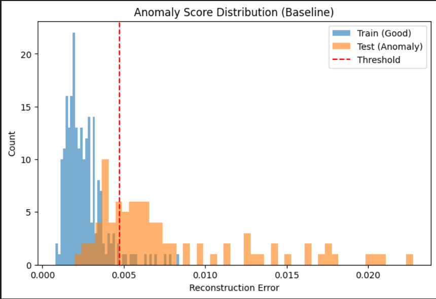
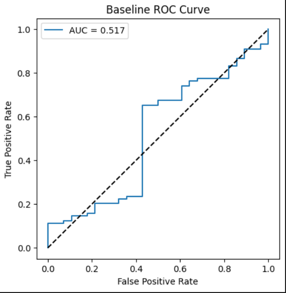
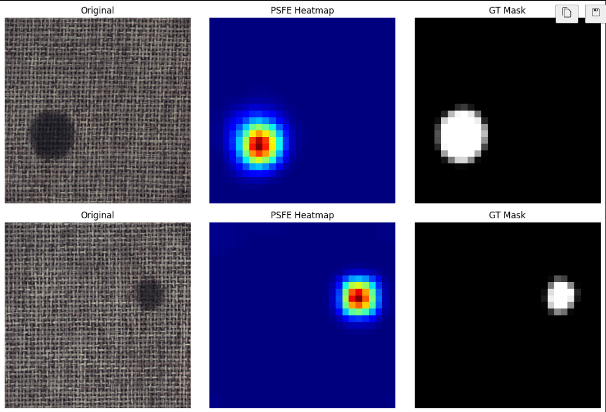
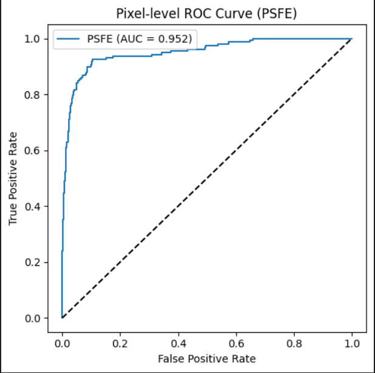

# Patch-wise Statistical Feature Encoding for Pixel-Level Anomaly Detection


This repository presents a **patch-wise statistical feature encoding (PSFE)** method for **pixel-level visual anomaly detection**, motivated by the failure of global feature aggregation to capture localized structural defects.

This repository is intended as a **research prototype and companion implementation** for patch-level statistical anomaly detection.

The project includes:
- A **baseline global feature model** highlighting its limitations.
- A **patch-wise statistical encoding approach** for anomaly localization.
- Quantitative and qualitative evaluation on the **MVTec AD dataset**.

---
## Table of Contents

- [Motivation](#motivation)
- [Dataset](#dataset)
- [Repository Structure](#repository-structure)
- [Baseline: Global Feature Aggregation](#baseline-global-feature-aggregation)
- [Proposed Method: PSFE](#proposed-method-patch-wise-statistical-feature-encoding-psfe)
- [Pixel-level Localization Performance](#pixel-level-localization-performance)
- [Quantitative Evaluation](#quantitative-evaluation)
- [Ablation Study](#ablation-study-effect-of-entropy)
- [Key Observations](#key-observations)
- [Future Work](#future-work)
- [Acknowledgements](#acknowledgements)

---


## Motivation

Most deep feature-based anomaly detection methods rely on **global average pooled representations**, which suppress localized defect cues.  
We show that such global representations perform poorly on structural anomalies and propose a **patch-level statistical alternative** that requires **no training and no memory bank**.

---

## Dataset

- **MVTec Anomaly Detection (AD) Dataset**
- Categories used:
  - Carpet
  - Grid
  - Bottle
  - Capsule
- The training set contains **only normal samples**, following the standard **MVTec AD protocol**.
- Evaluation performed at **pixel-level** using ground-truth segmentation masks.

<!-- Dataset link:  
https://www.mvtec.com/company/research/datasets/mvtec-ad -->
Dataset: [MVTec Anomaly Detection (AD)](https://www.mvtec.com/company/research/datasets/mvtec-ad)


---
## Repository Structure
The repository is organized as follows:

```text
.
├── checkpoints/
│   └── baseline_shallow_autoencoder.pth
│
├── notebooks/
│   ├── 01_baseline_global_ae.ipynb
│   └── 02_psfe.ipynb
│
├── evaluation_visuals/
│   ├── anomaly_score_distribution(baseline).png
│   ├── baseline_roc_curve.png
│   ├── Pixel-level-roc-curve.png
│   └── psfe-heatmaps.png
│
├── data/
|   ├── carpet
|   ├── grid
|   ├── bottle
|   ├── capsule
│   └── README.md
│
├── requirements.txt
├── research_paper_reference.pdf
└── README.md
```

---


## Baseline: Global Feature Aggregation
### Baseline Pipeline
1. Extract deep features using **ResNet-50**
   - Intermediate layers: **Layer2 and Layer3**
2. Apply **Global Average Pooling (GAP)**
3. Train a **shallow Autoencoder** on global features
4. Use reconstruction error as anomaly score
5. Perform **image-level anomaly classification**

### Baseline Limitation
Global feature aggregation suppresses localized defect patterns, leading to poor separability of structural anomalies.

**Baseline ROC-AUC ≈ 0.51**

---

### Baseline Results

**Anomaly Score Distribution (Baseline)**  


**Baseline ROC Curve**  


---

## Proposed Method: Patch-wise Statistical Feature Encoding (PSFE)

### Key Idea
Instead of aggregating features globally, anomalies are detected by **statistical deviations at the patch level**.

### PSFE Pipeline
1. Extract ResNet-50 **Layer2 & Layer3** feature maps
2. Spatially align and concatenate feature maps
3. Divide features into **patch-wise representations**
4. Compute **non-parametric statistics**:
   - Patch-level variance
   - Patch-level entropy
5. Generate **pixel-level anomaly maps**
6. Aggregate maps to obtain anomaly scores

> No Autoencoder  
> No PaDiM  
> No PatchCore  
> Training-free inference

---

## Pixel-level Localization Performance

**PSFE Anomaly Heatmaps**  


**Pixel-level ROC Curve**  


---

## Quantitative Evaluation

### PSFE Performance Across Categories
Pixel-level AUROC scores are reported across selected MVTec categories.

| Category | Mean Pixel AUROC | Std |
|--------|------------------|-----|
| Carpet | 0.989 | 0.005 |
| Grid | 0.934 | 0.077 |
| Bottle | 0.963 | 0.041 |
| Capsule | 0.944 | 0.053 |

---

## Ablation Study: Effect of Entropy

| Method | Mean Pixel AUROC | Std |
|------|------------------|-----|
| PSFE (variance only) | 0.989488 | 0.005129 |
| PSFE (variance + entropy) | 0.989431 | 0.005169 |

Including entropy does not significantly affect AUROC but improves **stability of patch-wise responses**, especially in structurally repetitive textures.

---

## Key Observations

- Global representations fail to capture localized anomalies
- Patch-wise statistics provide strong localization cues
- Training-free approaches can be competitive with learning-based anomaly detection methods
- Statistical encoding offers interpretability and simplicity

---

## Future Work

- Extension to additional MVTec categories
- Multi-scale patch aggregation
- Evaluation on real-world industrial datasets
- Comparison with memory-bank-based methods

---

## Acknowledgements

- Pretrained ResNet-50 from torchvision
- MVTec AD Dataset
